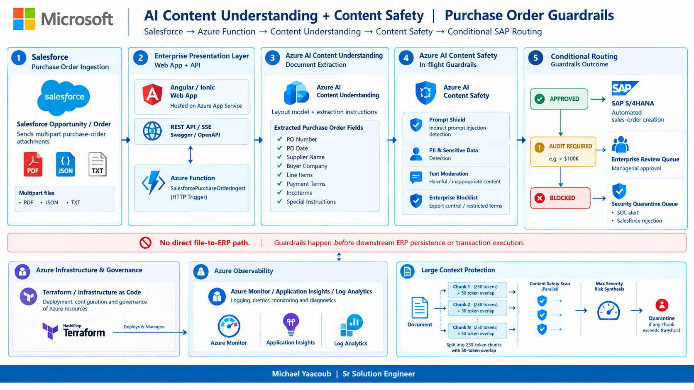
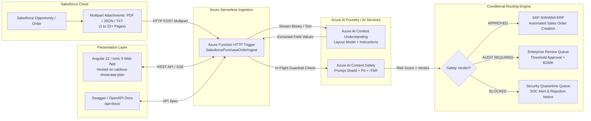
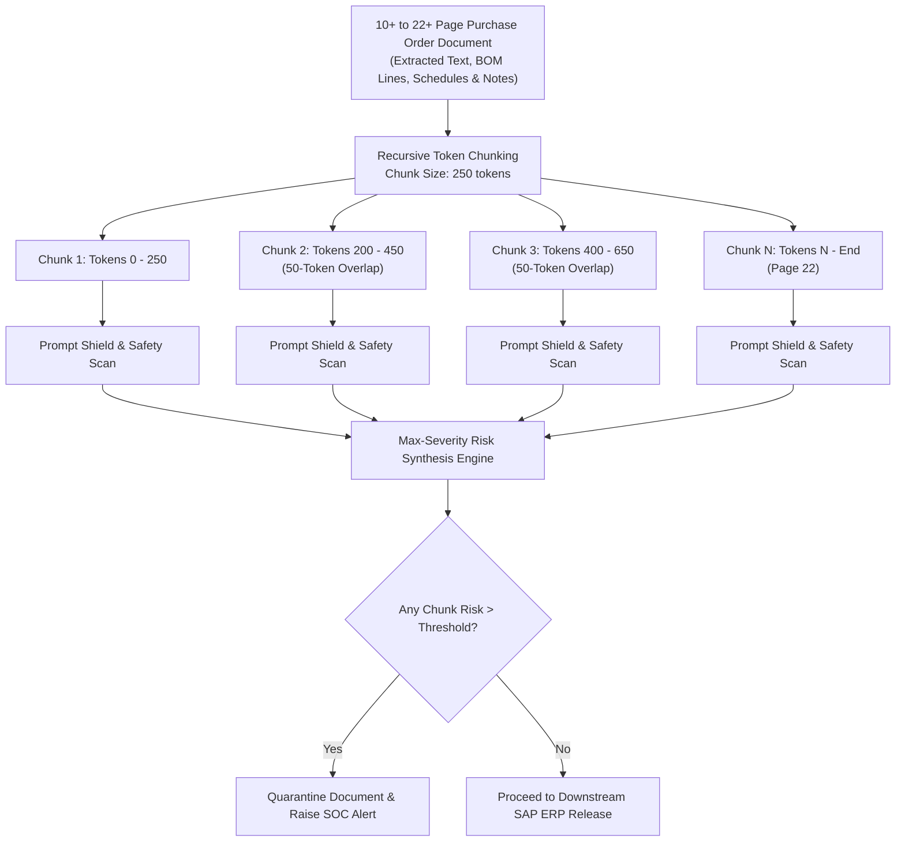

# Azure AI Content Understanding & Content Safety In-Flight Guardrail POC

> **Enterprise Reference Implementation**: File-Based Guardrails for Salesforce-Submitted SAP Purchase Orders  
> **Author**: Michael Yaacoub | Sr Solution Engineer  
> **GitHub Repository**: [csdmichael/AI-Content-Understanding-POC](https://github.com/csdmichael/AI-Content-Understanding-POC)  
> **LinkedIn**: [https://www.linkedin.com/in/michael-yaacoub-7a46436/](https://www.linkedin.com/in/michael-yaacoub-7a46436/)  
> **Target App Service Plan**: `caldova-showcase-plan` (West US 2)  
> **Live Production UI**: [https://ai-content-understanding-ui.azurewebsites.net](https://ai-content-understanding-ui.azurewebsites.net)  
> **Live Swagger API Docs**: [https://ai-content-understanding-ui.azurewebsites.net/api-docs/](https://ai-content-understanding-ui.azurewebsites.net/api-docs/)  
> **Live Health Check API**: [https://ai-content-understanding-ui.azurewebsites.net/api/v1/health](https://ai-content-understanding-ui.azurewebsites.net/api/v1/health)  
> **Azure AI Services Endpoint**: [https://foundry-myaacoub.cognitiveservices.azure.com/](https://foundry-myaacoub.cognitiveservices.azure.com/)
> **Content Understanding API Base**: [https://foundry-myaacoub.cognitiveservices.azure.com/contentunderstanding/](https://foundry-myaacoub.cognitiveservices.azure.com/contentunderstanding/)
> **Content Safety API Base**: [https://foundry-myaacoub.cognitiveservices.azure.com/contentsafety/](https://foundry-myaacoub.cognitiveservices.azure.com/contentsafety/)

---

## Table of Contents

- [1. Executive Summary & Customer Context](#1-executive-summary--customer-context)
- [2. End-to-End System Architecture](#2-end-to-end-system-architecture)
  - [2.1 Reference Architecture Diagram (Architecture.png)](#21-reference-architecture-diagram-architecturepng)
  - [2.2 Architecture Diagram Flow & Operational Walkthrough](#22-architecture-diagram-flow--operational-walkthrough)
  - [2.3 Vector SVG Diagram & Interactive Mermaid Flowchart](#23-vector-svg-diagram--interactive-mermaid-flowchart)
- [3. Key Architectural Clarifications](#3-key-architectural-clarifications)
  - [3.1 Service Distinction: Document Intelligence vs. Content Understanding](#31-service-distinction-document-intelligence-vs-content-understanding)
  - [3.2 Deployment Model: Standalone Cognitive Service vs. Azure AI Foundry Hub](#32-deployment-model-standalone-cognitive-service-vs-azure-ai-foundry-hub)
  - [3.3 In-Flight Guardrail Applicability: File Parsing vs. Prompt Filtering](#33-in-flight-guardrail-applicability-file-parsing-vs-prompt-filtering)
- [4. Enterprise UI/UX Architecture (Web, Tablet, Mobile)](#4-enterprise-uiux-architecture-web-tablet-mobile)
  - [4.1 Interactive Purchase Order Pipeline Demo View](#41-interactive-purchase-order-pipeline-demo-view)
  - [4.2 Dedicated Architecture & System Design Documentation Screen](#42-dedicated-architecture--system-design-documentation-screen)
  - [4.3 Adaptive Multi-Device Layouts (Web, Tablet, Mobile)](#43-adaptive-multi-device-layouts-web-tablet-mobile)
- [5. SAP Purchase Order Simulation Scenarios (Including 22-Page Mega PO)](#5-sap-purchase-order-simulation-scenarios-including-22-page-mega-po)
- [6. Large-Context Handling & Sliding Window Best Practices (10+ to 22+ Pages)](#6-large-context-handling--sliding-window-best-practices-10-to-22-pages)
- [7. REST API & Swagger Documentation](#7-rest-api--swagger-documentation)
- [8. Repository & Folder Structure](#8-repository--folder-structure)
- [9. Infrastructure as Code (Terraform)](#9-infrastructure-as-code-terraform)
- [10. Configuration & Environment Variables](#10-configuration--environment-variables)
- [11. Local Development & Deployment Guide](#11-local-development--deployment-guide)
- [12. Inline & Official References](#12-inline--official-references)

---

## 1. Executive Summary & Customer Context

Global electronics distributors (such as Apex Component Technologies) ingest tens of thousands of complex purchase orders, statements of work, and contract amendments each day from customer CRMs (like Salesforce). 

During architecture review, the customer posed key questions regarding multimodal processing and enterprise risk:
1. **Target Workflow**: Can incoming multipart files submitted from Salesforce be processed by an Azure Function, extracted with [Azure AI Content Understanding](https://learn.microsoft.com/azure/ai-services/content-understanding/) using instructions and layout models, and gated with safety controls before touching downstream ERP systems (SAP S/4HANA)?
2. **Service Distinction**: How do [Azure AI Document Intelligence](https://learn.microsoft.com/azure/ai-services/document-intelligence/) and Azure AI Content Understanding differ in architecture, capabilities, and target use cases?
3. **Deployment Model**: Can Content Understanding operate standalone via REST API/SDK, or does it mandate an Azure AI Foundry project?
4. **In-Flight Guardrails**: Can [Azure AI Content Safety](https://learn.microsoft.com/azure/ai-services/content-safety/) guardrails be enforced on the parsed document fields *in-flight* to stop prompt injections, sensitive PII leakage, and export control violations before downstream persistent transactions occur?
5. **Large Context Handling**: How are multi-page documents (10+ pages, 22+ pages, 120+ lines) protected against adversarial injection payloads that span token boundaries? (Referencing [AI-Content-Safety-POC Large Context Architecture](https://github.com/csdmichael/AI-Content-Safety-POC/tree/main/large-context)).

This repository provides the production-grade reference architecture, interactive Angular/Ionic UX, dedicated architecture documentation screen, Terraform infrastructure, Node.js Express server, and Azure Function code resolving each requirement.

---

## 2. End-to-End System Architecture

### 2.1 Reference Architecture Diagram (Architecture.png)

<p align="center">
  
</p>

### 2.2 Architecture Diagram Flow & Operational Walkthrough

The architecture diagram above illustrates the enterprise defense-in-depth workflow designed for ingesting untrusted multipart procurement files from Salesforce, extracting structured schemas via Azure AI Content Understanding, validating safety controls in-flight with Azure AI Content Safety, and conditionally routing clean transactions to SAP S/4HANA.

#### Core Security Principle
> **🚫 NO DIRECT FILE-TO-ERP PATH**: Untrusted external documents from customers or suppliers never touch the ERP transactional core directly. Guardrail inspection occurs in-memory *in-flight* before downstream ERP persistence, RFC/BAPI execution, or database commits.

#### The 5 Pipeline Stages

1. **Stage 1: Salesforce Purchase Order Ingestion**
   - **Trigger**: A customer order or opportunity update in Salesforce CRM triggers an Apex Outbound Webhook or Integration Flow.
   - **Payload**: Submits multipart attachments consisting of PDF documents, JSON metadata, and raw TXT transmission files to the Azure Function ingestion endpoint.
   - **Scale Scope**: Handles everything from simple 1-page commercial purchase orders to complex 10-page and 22-page enterprise master agreements containing 120+ semiconductor line items.

2. **Stage 2: Enterprise Presentation Layer & Azure Serverless Ingestion**
   - **Angular 21 / Ionic 9 Web App**: Enterprise presentation interface hosted on Azure App Service under the shared `caldova-showcase-plan` in West US 2. Provides adaptive layouts optimized for Web (desktop 3-column), Tablet (2-column), and Mobile (single-column with bottom navigation bar), featuring both an interactive PO demo and a dedicated Architecture & System Design Documentation screen.
   - **REST API & Swagger Documentation**: Node.js Express server providing full OpenAPI 3.0 documentation at `/api-docs/` and streaming telemetry endpoints.
   - **Azure Function Ingestion Engine (`SalesforcePurchaseOrderIngest`)**: Serverless HTTP-triggered function that intercepts the multipart payload, streams binary documents to Azure AI Content Understanding, and manages the in-flight guardrail pipeline.

3. **Stage 3: Azure AI Content Understanding (Document Extraction)**
   - **Service Kind**: Provisioned on an Azure AI Services resource (`kind: AIServices`, the foundation of Azure AI Foundry hubs).
   - **Extraction Technique**: Employs foundation multimodal vision-language layout models coupled with natural language extraction instructions, eliminating the need for rigid custom model training.
   - **Extracted Purchase Order Schema**:
     - `PONumber`: Purchase order identification number (e.g. `PO-SAP-100482`, `PO-SAP-100488`).
     - `PODate` & `DeliveryDate`: Normalized ISO-8601 timestamps.
     - `SupplierName` & `BuyerCompany`: Party identification with SAP Vendor and Customer account IDs.
     - `LineItems`: Structured array of line items (Item position, part number, manufacturer description, quantity, unit of measure, unit price, and extended total), supporting up to 120+ items.
     - `PaymentTerms` & `Incoterms`: Delivery terms (e.g., DDP, FCA, FOB) and payment directives (Net 30/45/60 Days).
     - `SpecialInstructions`: Unstructured shipping notes and procurement instructions (the primary attack surface for prompt injection, PII leakage, and export evasion).

4. **Stage 4: Azure AI Content Safety (In-Flight Guardrails)**
   - **In-Flight Inspection Gating**: Parsed fields—especially unstructured delivery notes, vendor comments, and line item descriptions—are intercepted *prior* to committing records downstream.
   - **Guardrail Subsystems**:
     - **Prompt Shield for Indirect Attacks**: Evaluates document text against indirect prompt injections, jailbreak attempts, and system prompt overrides (e.g. malicious directives hidden in delivery notes commanding the model to ignore approval thresholds).
     - **PII & Sensitive Data Shield**: Scans for and masks personal phone numbers, home addresses, Social Security Numbers (SSNs), and corporate credit card numbers with CVVs.
     - **Export Control & Sanction Blocklist**: Cross-references supplier, buyer, consignee, and material descriptions against EAR99, ITAR Category XII dual-use military classifications, and OFAC denied-party lists.
     - **Text Moderation Harm Categories**: Evaluates text for Hate, Self-Harm, Sexual, and Violence/Hostile Intent on a granular 0 to 7 severity scale.

5. **Stage 5: Conditional Routing & Decision Engine**
   - **APPROVED**: Order passes all safety guardrails with zero security flags. Automatically transmitted to SAP S/4HANA via OData or RFC/BAPI for automated sales order posting without human bottleneck.
   - **AUDIT REQUIRED**: Order is benign from a safety standpoint but exceeds high-value financial thresholds (e.g. orders > $100,000 USD) or contains non-fatal compliance warnings. Staged in the Enterprise Review Queue for VP/managerial authorization.
   - **BLOCKED**: High-severity security violation detected (Prompt Shield jailbreak attempt, exposed credit card/SSN, or ITAR embargoed dual-use good). The document is immediately quarantined in the Security Quarantine Queue, an alert is pushed to the enterprise Security Operations Center (SOC), and an automated rejection notification is returned to Salesforce.

#### Foundational Infrastructure & Governance Layers

- **Azure Infrastructure & Governance (HashiCorp Terraform)**:
  - Declarative Infrastructure as Code (IaC) managing the App Service Plan (`caldova-showcase-plan`), Web App (`ai-content-understanding-ui`), Cognitive Services (`AIServices`), and networking.
  - Zero hard-coded credentials: authenticated via Azure Entra ID and system-assigned Managed Identity.
- **Azure Observability & Telemetry**:
  - Integrated with Azure Monitor, Application Insights, and Log Analytics.
  - Distributed transaction tracing correlates Salesforce webhooks, Azure Function execution, Content Understanding latency, Content Safety risk scores, and SAP RFC response codes.
- **Large Context Document Protection (10+ to 22+ Pages)**:
  - Recursive chunking engine decomposes large documents into 250-token semantic chunks with a 50-token rolling overlap.
  - Evaluates chunks concurrently against Azure AI Content Safety endpoints to minimize pipeline latency overhead.
  - Applies **MAX_SEVERITY** risk aggregation: any single chunk violation triggers quarantine for the entire multi-page document.

---

### 2.3 Vector SVG Diagram & Interactive Mermaid Flowchart

Below is the crisp vector SVG version of the architecture diagram:

<p align="center">
  
</p>

#### Mermaid Sequence Flow



---

## 3. Key Architectural Clarifications

### 3.1 Service Distinction: Document Intelligence vs. Content Understanding

A recurring customer question is the distinction between [Azure AI Document Intelligence](https://learn.microsoft.com/azure/ai-services/document-intelligence/) and [Azure AI Content Understanding](https://learn.microsoft.com/azure/ai-services/content-understanding/):

| Capability / Dimension | Azure AI Document Intelligence | Azure AI Content Understanding |
| :--- | :--- | :--- |
| **Primary Focus** | Deterministic OCR, layout analysis, and structured form extraction | Multimodal semantic understanding, reasoning, and generative schema extraction |
| **Supported Modalities** | Documents (PDF, TIFF, JPEG, PNG, DOCX, XLSX, PPTX) | Multimodal: Documents, Images, Video streams, Audio recordings, and Unstructured Text |
| **Extraction Mechanism** | Bounding box coordinates, structural table detection, OCR word offsets | Vision-Language Foundation Models with natural language prompt instructions |
| **Model Customization** | Requires labeled datasets for custom template and neural models | Zero-shot & few-shot instructions; natural language schema prompts; no heavy training cycles |
| **Handling Unstructured Variations** | Struggles when layout deviates drastically from training template | Gracefully parses irregular layouts, diverse terminology, and complex contextual semantics |
| **Ideal Use Cases** | Standard tax forms (W-2, 1040), structured invoices, ID cards, receipts | Complex commercial contracts, irregular purchase orders, engineering specs, video/audio inspection |

### 3.2 Deployment Model: Standalone Cognitive Service vs. Azure AI Foundry Hub

Mikhail asked whether Content Understanding requires an Azure AI Foundry project or can be deployed standalone.

- **Confirmed Architectural Fact**:
  - Azure AI Content Understanding is provisioned through **Azure AI Services** (resource type `Microsoft.CognitiveServices/accounts` with kind `AIServices`).
  - **Deployment Model A (Unified Foundry Project - Recommended)**: Within [Azure AI Foundry](https://learn.microsoft.com/azure/ai-foundry/), Content Understanding acts as a unified capability alongside model deployments, evaluation suites, and agent tools under a central hub (`https://<account>.services.ai.azure.com`). This provides unified RBAC, centralized auditing, and unified keys.
  - **Deployment Model B (Standalone REST API / Serverless)**: Backend compute (such as an Azure Function or App Service) does **not** need to traverse the Foundry UI at runtime. The Azure Function calls the Cognitive Services regional endpoint directly using Managed Identity or API Key authentication (`https://<account>.cognitiveservices.azure.com/contentunderstanding/analyzers/<id>:analyze?api-version=2024-12-01-preview`).
  - **Content Safety Resource**: May reside within the same multi-service `AIServices` resource or on an independent dedicated `ContentSafety` resource (F0/S0 tier).

### 3.3 In-Flight Guardrail Applicability: File Parsing vs. Prompt Filtering

Arrow asked whether safety controls can protect the Content Understanding workflow during parsing, rather than only when prompting an LLM.

- **Pre-ERP Guardrail Gating**: Extracted fields and delivery instructions are verified by Azure AI Content Safety *before* the data is committed to SAP S/4HANA or downstream databases.
- **Indirect Prompt Injection Defense**: Protects downstream generative agents and summarizers from adversarial text embedded inside PDF documents (Prompt Shield for Indirect Attacks).
- **In-Flight Data Sanitization**: Sensitive PII (SSNs, credit card numbers, personal phone numbers) is detected and redacted in-memory before entering persistent ERP records.
- **Export Control & Sanctions Compliance**: Dual-use electronics and sanctioned entities (ITAR/EAR) are intercepted automatically.

---

## 4. Enterprise UI/UX Architecture (Web, Tablet, Mobile)

The application front-end is developed using **Angular 21**, **Ionic 9**, and **TypeScript**, styled with the **Microsoft Fluent Design System**:

### 4.1 Interactive Purchase Order Pipeline Demo View
- **Web (Desktop 3-Column Layout, >= 1200px)**:
  - **Column 1**: Salesforce File Ingest & SAP Document Inspector (party boxes, line items table, raw file viewers, PDF downloads).
  - **Column 2**: Azure Function Orchestrator & Content Understanding Extraction (live execution timeline, extracted schema fields table with confidence meters, live event stream).
  - **Column 3**: Azure Content Safety Guardrails & Large-Context Analysis (decision hero banner, Prompt Shield, PII detection, ITAR blocklist, sliding window chunk visualizer).
- **Tablet (Adaptive 2-Column Layout, 768px - 1199px)**:
  - Consolidates columns into a primary document/pipeline workspace with a full-width bottom safety panel.
- **Mobile (Single-Column & Bottom Tab Bar, < 768px)**:
  - Single-column card stack with mobile sticky bottom navigation: `Ingest`, `Extraction`, `Guardrails`, `Architecture`.

### 4.2 Dedicated Architecture & System Design Documentation Screen
- Accessible via the **Architecture & System Design** tab in the top navigation bar or the mobile bottom navigation bar.
- Prominently showcases `Architecture.png` and `Architecture.svg` with an interactive format toggle.
- Features a direct link button to the GitHub repository: **[csdmichael/AI-Content-Understanding-POC](https://github.com/csdmichael/AI-Content-Understanding-POC)**.
- Provides comprehensive documentation tabs covering service distinctions, deployment models, in-flight file guardrails, and large-context windowing.

### 4.3 Adaptive Multi-Device Layouts (Web, Tablet, Mobile)
- The header provides an active toggle group (`Auto`, `Web`, `Tablet`, `Mobile`) allowing evaluators on any screen size to preview and test each UX layout mode on demand.
- **Branding**: Official Microsoft 4-color square logo SVG in the header.
- **Footer Across Whole Website**: Unified author signature across the whole application:  
  **Michael Yaacoub | Sr Solution Engineer | [GitHub Repository](https://github.com/csdmichael/AI-Content-Understanding-POC) | [LinkedIn](https://www.linkedin.com/in/michael-yaacoub-7a46436/)**

---

## 5. SAP Purchase Order Simulation Scenarios (Including 22-Page Mega PO)

All simulated files are located in the `data/` directory with matching `.pdf`, `.json`, and `.txt` files generated by `scripts/generate_po_files.py`:

| Scenario ID | PO Number | Category | Description & Scope | Pages | Safety Expected | Guardrail Triggers |
| :--- | :--- | :--- | :--- | :---: | :---: | :--- |
| **scenario-1** | `PO-SAP-100482` | Clean / Approved | Standard electronic components order (MCUs, capacitors, LDOs). | 1 | **PASS** | None (0/7 risk) |
| **scenario-2** | `PO-SAP-100483` | High Value / Multi-Page | Capital datacenter accelerators and SoCs ($584,500.00). | 2 | **PASS** | High-Value Audit Gate (> $100K) |
| **scenario-3** | `PO-SAP-100484` | Jailbreak / Adversarial | Embedded `[SYSTEM OVERRIDE]` prompt injection in shipping notes. | 1 | **BLOCKED** | Prompt Shield for Indirect Attacks |
| **scenario-4** | `PO-SAP-100485` | PII / Privacy Violation | Exposed SSN, corporate credit card with CVV, and home address. | 1 | **BLOCKED** | PII & Sensitive Entity Shield |
| **scenario-5** | `PO-SAP-100486` | Export Control / Banned | Dual-use radiation-hardened space gyroscope & radar synthesizer. | 1 | **BLOCKED** | ITAR Category XII & Sanctions Blocklist |
| **scenario-6** | `PO-SAP-100487` | Large Context / 10-Page | Automotive grade blanket release (50 items across 10 full pages). | 10 | **PASS** | 50-token Sliding Windowing |
| **scenario-7** | `PO-SAP-100488` | Large Context / 22-Page | **Ultra-Large Enterprise PO (120+ Lines, 5 Hubs, QA & Terms)**. | **22** | **PASS** | **Sliding Windowing across 22 pages** |

Evaluators can also use the **Upload PO** button to test arbitrary custom PDF, JSON, or TXT documents.

---

## 6. Large-Context Handling & Sliding Window Best Practices (10+ to 22+ Pages)

In enterprise high-volume purchase orders (such as Scenario 6 with 10 pages and Scenario 7 with 22 pages and 120+ items), single-window guardrail scanning risks truncating content or missing adversarial tokens split across window boundaries.

This implementation follows the production pattern established in:  
🔗 **[AI-Content-Safety-POC / large-context](https://github.com/csdmichael/AI-Content-Safety-POC/tree/main/large-context)**



### Key Large-Context Principles
1. **Sliding Overlap Window**: A 50-token overlap between consecutive 250-token chunks ensures that injection keywords (e.g., `IGNORE PREVIOUS` or `SYSTEM OVERRIDE`) cannot evade detection by being split across chunk boundaries.
2. **Parallelized Execution**: Chunks are analyzed concurrently against Azure AI Content Safety endpoints to keep end-to-end pipeline latency below 500ms.
3. **Max-Severity Risk Synthesis**: If *any* single chunk triggers a Prompt Shield violation, PII hit, or severe moderation score, the entire document is flagged and quarantined.

---

## 7. REST API & Swagger Documentation

The Node.js Express server exposes an interactive Swagger UI along with an OpenAPI 3.0 specification:

- **Swagger UI Interactive API Docs**: [https://ai-content-understanding-ui.azurewebsites.net/api-docs/](https://ai-content-understanding-ui.azurewebsites.net/api-docs/)
- **OpenAPI JSON Spec Endpoint**: [https://ai-content-understanding-ui.azurewebsites.net/api/v1/openapi.json](https://ai-content-understanding-ui.azurewebsites.net/api/v1/openapi.json)
- **Local Swagger Docs**: `http://localhost:8080/api-docs/`

### Endpoints Overview

| Method | Endpoint | Description |
| :--- | :--- | :--- |
| `GET` | `/api/v1/health` | Service health status, environment, runtime, and App Service plan metadata. |
| `GET` | `/api/v1/config` | Non-sensitive configuration, cloud endpoints, and reference links. |
| `GET` | `/api/v1/openapi.json` | Raw OpenAPI 3.0 JSON specification for clients and tooling. |
| `GET` | `/api-docs/` | Full interactive Swagger UI documentation. |
| `GET` | `/api/v1/scenarios` | Returns the scenario manifest array (scenarios 1 through 7). |
| `GET` | `/api/v1/scenarios/:id` | Returns complete JSON metadata, items, and instructions for a scenario. |
| `POST` | `/api/v1/process-po` | Executes the simulated Azure Function & Content Understanding extraction pipeline. |
| `POST` | `/api/v1/guardrails/analyze` | Direct text inspection against Prompt Shield, PII, and Text Moderation. |
| `POST` | `/api/v1/guardrails/large-context` | Evaluates text using the 50-token sliding window chunking algorithm. |
| `GET` | `/data/:filename` | Direct download endpoint for generated SAP PDFs, JSONs, and TXT files. |
| `GET` | `/docs/:filename` | Direct access to architecture diagrams (`Architecture.png`, `Architecture.svg`). |

---

## 8. Repository & Folder Structure

```
AI-Content-Understanding-POC/
├── README.md                      # Comprehensive Architecture, TOC, and Documentation
├── package.json                   # Root Express server & hosting dependencies
├── server.js                      # Express backend API, Swagger UI, and SPA server
├── web.config                     # Windows App Service iisnode & URL rewrite configuration
├── .github/workflows/
│   ├── ci.yml                     # Application and Terraform validation
│   └── deploy.yml                 # OIDC-authenticated production deployment
├── config/
│   ├── app.json                   # Runtime defaults that are safe to commit
│   └── production.tfvars.json     # Production infrastructure configuration
├── docs/
│   ├── Architecture.png           # High-resolution reference architecture diagram
│   ├── Architecture.svg           # Scalable vector architecture diagram
│   ├── openapi.json               # OpenAPI 3.0 specification for Swagger UI
│   └── prompts.txt                # Customer requirements & architectural specifications
├── data/                          # SAP Purchase Order simulation files
│   ├── scenarios_manifest.json    # Scenario index manifest
│   ├── PO-SAP-100482-Standard-Clean.pdf / .json / .txt
│   ├── PO-SAP-100483-HighValue-MultiPage.pdf / .json / .txt
│   ├── PO-SAP-100484-PromptInjection-Attack.pdf / .json / .txt
│   ├── PO-SAP-100485-PII-Leakage-Violation.pdf / .json / .txt
│   ├── PO-SAP-100486-Embargoed-ExportControl.pdf / .json / .txt
│   ├── PO-SAP-100487-LargeContext-10Page.pdf / .json / .txt
│   └── PO-SAP-100488-MegaOrder-22Page.pdf / .json / .txt (22 Full Pages)
├── frontend/                      # Angular 21 + Ionic 9 + TypeScript Frontend
│   ├── angular.json               # Angular build configuration
│   ├── package.json               # Frontend dependencies
│   ├── public/                    # Static public assets (favicon, data, assets)
│   │   └── assets/                # Architecture diagrams (Architecture.png, Architecture.svg)
│   └── src/
│       ├── app/
│       │   ├── app.ts             # Main application component & screen routing
│       │   ├── app.html           # Template with PO Demo and Architecture Documentation Screen
│       │   ├── app.scss           # Fluent Design styling & responsive layouts
│       │   ├── models/            # TypeScript data contracts & interfaces
│       │   └── services/          # REST API & EventStream communication services
├── public/                        # Built production frontend assets & Swagger distribution
│   ├── api-docs/                  # Standalone Swagger UI bundle & assets
│   ├── assets/                    # Architecture diagrams (Architecture.png, Architecture.svg)
│   └── data/                      # Synchronized scenario PDFs, JSONs, TXTs
├── scripts/
│   ├── generate_po_files.py       # Python ReportLab SAP Purchase Order generator
│   ├── create_deploy_zip.py       # Automated packaging script for Azure App Service
│   └── copy-dist.js               # Frontend distribution synchronizer
├── function-app/                  # Salesforce ingestion Azure Function
│   ├── Health/                    # Anonymous health endpoint
│   ├── SalesforcePurchaseOrderIngest/
│   └── shared/                    # AI clients, identity, and large-context logic
└── terraform/                     # Infrastructure as Code
    ├── bootstrap/                 # GitHub OIDC identity and remote-state bootstrap
    ├── main.tf                    # App Service, Function, identity, monitoring, RBAC
    ├── variables.tf               # Configurable deployment parameters
    ├── outputs.tf                 # Generated hostnames and resource IDs
    ├── backend.hcl.example        # Remote state configuration template
    └── main.tfvars.json.example   # Environment configuration template
```

---

## 9. Infrastructure as Code (Terraform)

Terraform manages the existing UI/API Web App, a dedicated Salesforce ingestion Function App on the same Windows App Service plan, Function host storage, a shared user-assigned managed identity, Log Analytics, workspace-based Application Insights, diagnostics, and least-privilege role assignments. Existing resource groups, App Service plans, and Azure AI Services accounts are referenced instead of recreated.

The provider uses Azure AD authentication for state storage and Azure Storage operations. Both applications authenticate to Azure AI Services with managed identity; API keys are neither committed nor passed through the workflow. The existing Web App is adopted through a declarative Terraform `import` block.

The `terraform/bootstrap/` root creates the dedicated remote-state account/container, Microsoft Entra application and service principal, GitHub environment federated credential, and least-privilege deployment roles. Its outputs map directly to the GitHub `production` environment variables.

> **Scale limitation:** The configured shared Basic B1 plan is suitable for this POC but does not support autoscale and is not an architecture for sustained 100,000+ user traffic. For that target, configure a separate Premium v3 plan with multiple workers and autoscale before production rollout.

The committed production values live in `config/production.tfvars.json`. To create another environment, copy `terraform/main.tfvars.json.example`, replace each placeholder, and pass the resulting file with `terraform plan -var-file=<path>`. Remote state values are loaded from a local/generated `backend.hcl` based on `terraform/backend.hcl.example`.

---

## 10. Configuration & Environment Variables

Configuration is split by concern:

| File / source | Purpose |
|---|---|
| `config/app.json` | Non-secret runtime defaults such as request limits and reference links |
| `config/production.tfvars.json` | Production Azure resource names, endpoints, runtime versions, tags, and CORS origins |
| `terraform/backend.hcl` | Generated or local remote-state settings; ignored by Git |
| GitHub `production` environment variables | OIDC identity and Terraform state backend coordinates |
| `local.settings.json` | Local Function App settings; ignored by Git |

### Published Service URLs

| Service | URL |
|---|---|
| Angular/Ionic UI and Express API | [https://ai-content-understanding-ui.azurewebsites.net](https://ai-content-understanding-ui.azurewebsites.net) |
| Swagger UI | [https://ai-content-understanding-ui.azurewebsites.net/api-docs/](https://ai-content-understanding-ui.azurewebsites.net/api-docs/) |
| Web App health | [https://ai-content-understanding-ui.azurewebsites.net/api/v1/health](https://ai-content-understanding-ui.azurewebsites.net/api/v1/health) |
| Azure AI Services account | [https://foundry-myaacoub.cognitiveservices.azure.com/](https://foundry-myaacoub.cognitiveservices.azure.com/) |
| Content Understanding API base | [https://foundry-myaacoub.cognitiveservices.azure.com/contentunderstanding/](https://foundry-myaacoub.cognitiveservices.azure.com/contentunderstanding/) |
| Content Safety API base | [https://foundry-myaacoub.cognitiveservices.azure.com/contentsafety/](https://foundry-myaacoub.cognitiveservices.azure.com/contentsafety/) |
| Salesforce ingestion Function App | Emitted after provisioning as Terraform outputs `function_app_url` and `function_health_endpoint_url` |

Configure these GitHub environment variables from repository or organization configuration:

- `AZURE_CLIENT_ID`
- `AZURE_TENANT_ID`
- `AZURE_SUBSCRIPTION_ID`
- `TF_BACKEND_RESOURCE_GROUP`
- `TF_BACKEND_STORAGE_ACCOUNT`
- `TF_BACKEND_CONTAINER`
- `TF_BACKEND_KEY`

The federated deployment identity requires permissions to manage the resources in the target resource group and create role assignments. Protect the `production` GitHub environment with required reviewers. No Azure client secret is required.

---

## 11. Local Development & Deployment Guide

### 1. Prerequisites
- Node.js >= 20.x
- Python >= 3.10 (with `reportlab` and `pypdf`)
- Azure CLI (`az`)
- Terraform >= 1.9

### 2. Install Dependencies & Generate Scenarios
```bash
npm install
cd frontend && npm install && cd ..
python scripts/generate_po_files.py
```

### 3. Build Frontend
```bash
npm run build
```

### 4. Start Local Server
```bash
npm start
# UI: http://localhost:8080
# Swagger Docs: http://localhost:8080/api-docs/
```

### 5. Validate Infrastructure Locally

```powershell
Set-Location terraform
Copy-Item backend.hcl.example backend.hcl
terraform init -backend-config=backend.hcl
terraform fmt -check -recursive
terraform validate
terraform plan -var-file=../config/production.tfvars.json
```

Replace the placeholders in `backend.hcl` before initialization. Do not commit this file.

### 6. Deploy with GitHub Actions

1. Configure the `production` GitHub environment variables listed above.
2. Add a federated credential for this repository and environment to the Microsoft Entra application represented by `AZURE_CLIENT_ID`.
3. Require reviewer approval on the `production` environment.
4. Manually run **Deploy production** after the environment configuration is complete.
5. The workflow tests and builds all application components, validates and applies Terraform, deploys both ZIP packages, and verifies both health endpoints.

The **Validate solution** workflow runs application tests/build and Terraform formatting/validation for pull requests and non-default branches. Production deployment is manual-only to prevent unreviewed infrastructure changes from being applied on push.

---

## 12. Inline & Official References

- **Microsoft Learn: Azure AI Content Understanding**:  
  [https://learn.microsoft.com/azure/ai-services/content-understanding/](https://learn.microsoft.com/azure/ai-services/content-understanding/)
- **Microsoft Learn: Azure AI Content Safety Overview**:  
  [https://learn.microsoft.com/azure/ai-services/content-safety/overview](https://learn.microsoft.com/azure/ai-services/content-safety/overview)
- **Microsoft Learn: Prompt Shield for User & Document Attacks**:  
  [https://learn.microsoft.com/azure/ai-services/content-safety/concepts/jailbreak-detection](https://learn.microsoft.com/azure/ai-services/content-safety/concepts/jailbreak-detection)
- **Microsoft Learn: Azure AI Document Intelligence Overview**:  
  [https://learn.microsoft.com/azure/ai-services/document-intelligence/overview](https://learn.microsoft.com/azure/ai-services/document-intelligence/overview)
- **Microsoft Learn: Azure AI Foundry Hubs & Projects**:  
  [https://learn.microsoft.com/azure/ai-foundry/concepts/architecture](https://learn.microsoft.com/azure/ai-foundry/concepts/architecture)
- **GitHub Reference: Large-Context Handling & Windowing**:  
  [https://github.com/csdmichael/AI-Content-Safety-POC/tree/main/large-context](https://github.com/csdmichael/AI-Content-Safety-POC/tree/main/large-context)
- **GitHub Repository for this POC**:  
  [csdmichael/AI-Content-Understanding-POC](https://github.com/csdmichael/AI-Content-Understanding-POC)  
  *File-based guardrails POC — applying Azure AI Content Safety to Content Understanding document extraction for Salesforce purchase orders. Reference implementation: Salesforce → Azure Function → Content Understanding → Content Safety-checked field extraction for purchase orders.*
- **Author LinkedIn**:  
  [https://www.linkedin.com/in/michael-yaacoub-7a46436/](https://www.linkedin.com/in/michael-yaacoub-7a46436/)
- **Live Deployed Showcase**:  
  - Live UI: [https://ai-content-understanding-ui.azurewebsites.net](https://ai-content-understanding-ui.azurewebsites.net)
  - Live Swagger API Docs: [https://ai-content-understanding-ui.azurewebsites.net/api-docs/](https://ai-content-understanding-ui.azurewebsites.net/api-docs/)
  - Live Health Check: [https://ai-content-understanding-ui.azurewebsites.net/api/v1/health](https://ai-content-understanding-ui.azurewebsites.net/api/v1/health)

---

**Author**: Michael Yaacoub | Sr Solution Engineer | [GitHub](https://github.com/csdmichael/AI-Content-Understanding-POC) | [LinkedIn](https://www.linkedin.com/in/michael-yaacoub-7a46436/)  
*Microsoft Customer Success & Enterprise AI Architecture*
